<div align="center">

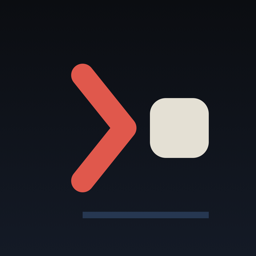

# PocketTmux

**Your Mac's tmux, in your pocket.**

A menu-bar agent for the Mac and a native iPhone terminal that attach to the **same tmux server** —
over Wi-Fi or Tailscale, with no cloud in between.

[](https://github.com/waylake/pockettmux/actions/workflows/ci.yml)
[](https://github.com/waylake/pockettmux/releases)
[](#install)
[](#install)
[](App/PocketTmuxKit/Package.swift)
[](https://github.com/tmux/tmux)
[](LICENSE)

<p>
  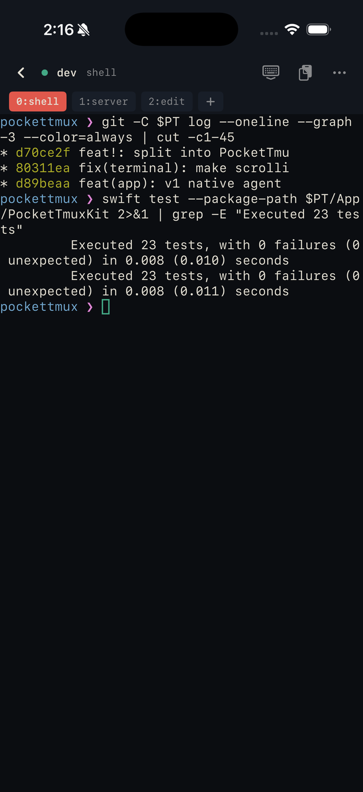
  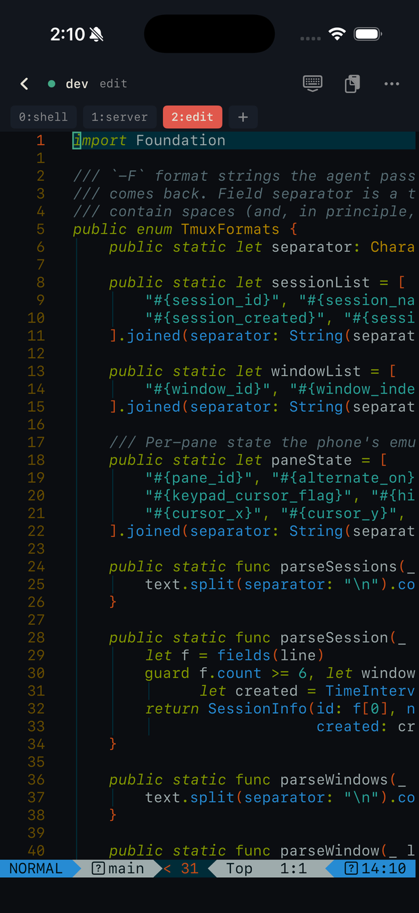
  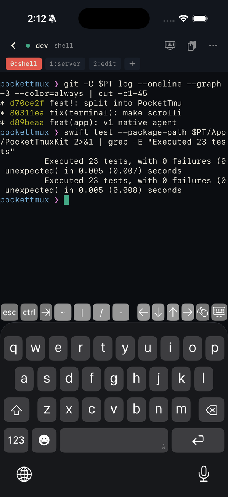
</p>

</div>

---

The pane your Mac's terminals see is the pane your phone renders. A key tapped on the phone is a
tmux key in the real pane; the pane's bytes stream back and are drawn by a native VT engine
(SwiftTerm). **tmux stays the single source of truth** — the phone is one more client, exactly like
a terminal window on the Mac.

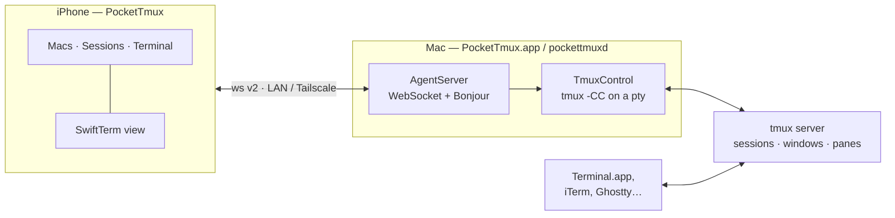

Two apps, one Swift package, no third-party services and no daemon to install beyond `tmux` itself.

## Screens

<table>
<tr>
<td width="33%" align="center">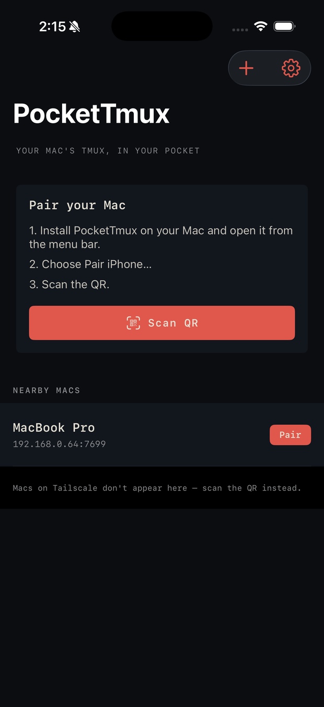<br><sub><b>First run</b><br>Pair by QR, or pick a Mac found over Bonjour</sub></td>
<td width="33%" align="center">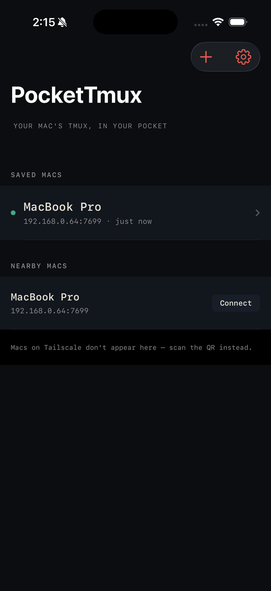<br><sub><b>Macs</b><br>Saved Macs in the Keychain · nearby Macs live</sub></td>
<td width="33%" align="center">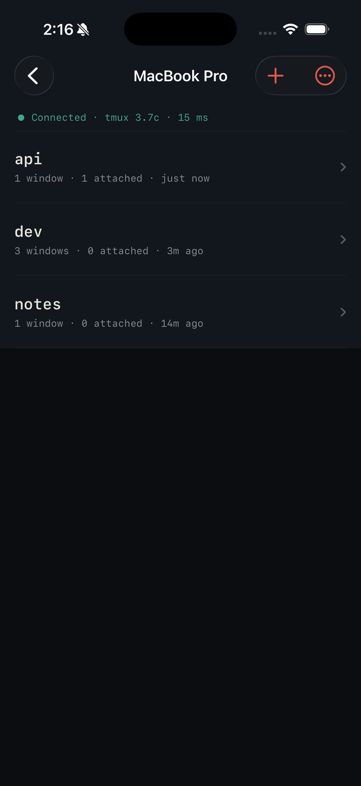<br><sub><b>Sessions</b><br>Live tmux sessions, round-trip time, new / rename / kill</sub></td>
</tr>
</table>

<table>
<tr>
<td width="34%" align="center">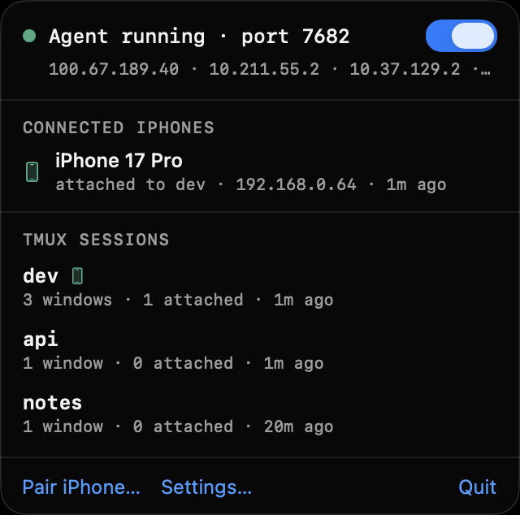<br><sub><b>Menu bar</b><br>Agent state, addresses, connected iPhones, live sessions</sub></td>
<td width="33%" align="center">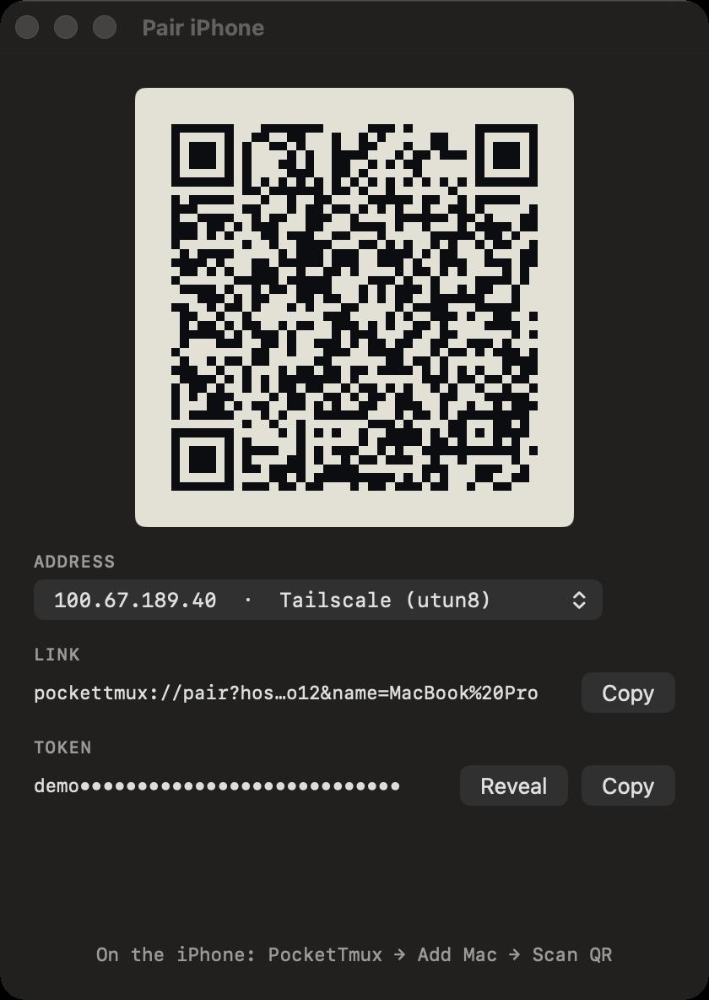<br><sub><b>Pair iPhone…</b><br>QR + link + token, address picker (Tailscale first)</sub></td>
<td width="33%" align="center">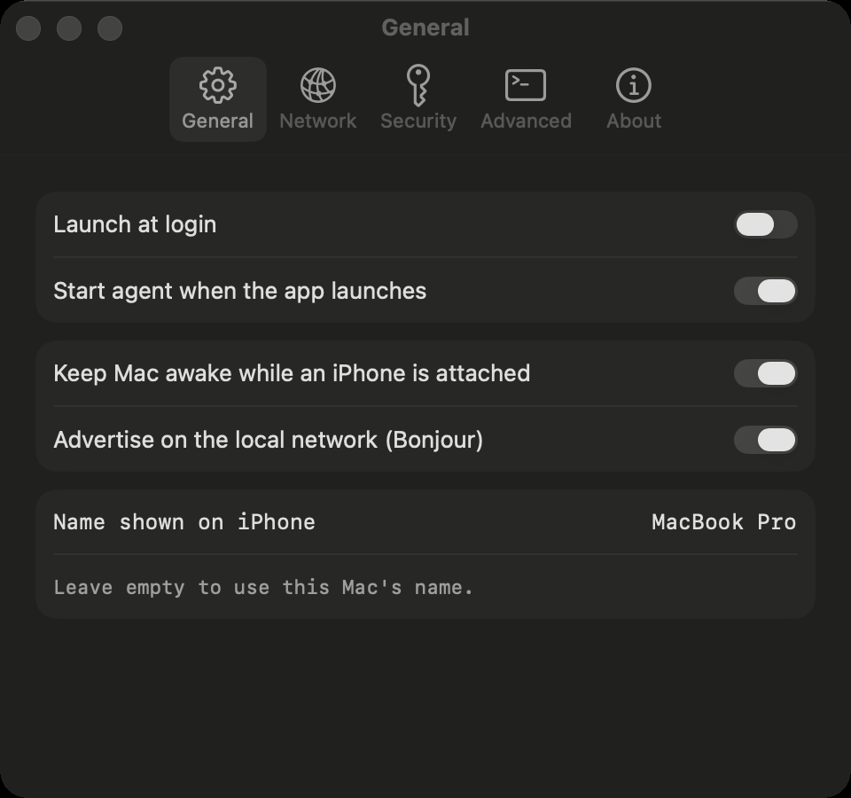<br><sub><b>Settings</b><br>Launch at login, keep awake, Bonjour, port, token, tmux path</sub></td>
</tr>
</table>

## Features

**PocketTmux for Mac** — macOS 14+, menu bar, not sandboxed (it execs your `tmux` and opens a pty)

|  | |
|---|---|
| **Agent** | Start/stop, port, status and every reachable address (Tailscale listed first) |
| **Pairing** | QR / `pockettmux://` link / copyable token, with the address you choose |
| **Visibility** | Connected iPhones and the session each one is on; live tmux sessions with *open in Terminal* and *kill* |
| **Settings** | Launch at login, auto-start, keep the Mac awake while a phone is attached, Bonjour advertising, display name, port, token regenerate, `tmux` path, ring log |
| **Headless** | `pockettmuxd` — the same agent as a CLI for remote or scripted Macs |

**PocketTmux for iPhone** — iOS 16+

|  | |
|---|---|
| **Macs** | Many saved Macs (Keychain), nearby Macs over Bonjour, add by QR / link / manual entry |
| **Sessions** | Live list with window and client counts, attach, create, rename, kill, RTT next to the status dot |
| **Terminal** | SwiftTerm rendering (TrueColor, alternate screen, mouse reporting), accessory keyboard (<kbd>esc</kbd> <kbd>ctrl</kbd> <kbd>⇥</kbd> <kbd>~</kbd> <kbd>\|</kbd> arrows), window strip (switch / new / rename / kill), paste with bracketed-paste semantics, font size, haptic bell, keep-awake |
| **Scrolling** | Swipe scrollback inside TUIs *and* shells — the first paint after any attach is rebuilt from tmux's own state, so nothing is blank or garbled ([why this is hard](docs/TROUBLESHOOTING.md#3-nothing-scrolls--not-in-a-tui-not-in-the-shell-scrollback)) |
| **Resilience** | Jittered backoff reconnect with automatic re-attach after Wi-Fi drops, backgrounding and Mac sleep |

## Install

### Mac

```sh
# 1 · download PocketTmux-macOS-*.zip from Releases, then
mv PocketTmux.app /Applications
brew install tmux            # the only prerequisite
open /Applications/PocketTmux.app
```

CI builds are unsigned — the first launch needs **right-click → Open**. The app appears in the menu
bar; choose **Pair iPhone…**.

> [!NOTE]
> macOS shows the *"allow incoming connections?"* firewall prompt on first start. Allow it, or the
> phone cannot reach the agent.

### iPhone

Download `PocketTmux-iOS-*-unsigned.ipa` from [Releases](https://github.com/waylake/pockettmux/releases)
and re-sign it with your own Apple ID (Sideloadly, AltStore), or build and run the `PocketTmux`
scheme on your device from Xcode — no paid developer account needed either way.

### Pair

1. Mac: menu bar → **Pair iPhone…**
2. iPhone: **+** → **Scan QR** (on the same Wi-Fi the Mac also appears under *Nearby Macs*)
3. Tap a session. You're in.

> [!TIP]
> Tailscale works out of the box and needs no port forwarding: the pairing QR carries the
> `100.x.y.z` address, and mDNS is not required.

## How an attach works

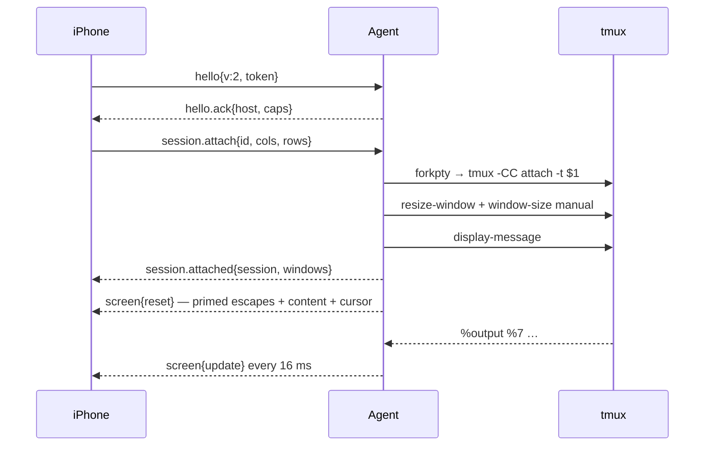

Control mode gives exact bytes and stable ids but replays nothing that predates the client, so the
agent primes the first frame from tmux's own state — the trick that makes scrollback and TUIs work
on the phone. Full flows in [ARCHITECTURE §4](docs/ARCHITECTURE.md#4-request-flow); frames in
[PROTOCOL](docs/PROTOCOL.md).

## Build from source

Prereqs: macOS 26, Xcode 26.2+, `brew install xcodegen tmux` (`swiftlint` optional).

```sh
git clone https://github.com/waylake/pockettmux.git
cd pockettmux/App
xcodegen generate            # PocketTmux.xcodeproj from Project.yml (git-ignored)
open PocketTmux.xcodeproj    # schemes: PocketTmux (iOS) · PocketTmuxMac · pockettmuxd
```

<details>
<summary>Command line — every <code>xcodebuild</code> needs <code>-skipPackagePluginValidation</code></summary>

```sh
# Mac app
xcodebuild build -scheme PocketTmuxMac -destination 'platform=macOS' \
  -derivedDataPath build/Mac -skipPackagePluginValidation
open build/Mac/Build/Products/Debug/PocketTmux.app

# iPhone app (simulator)
xcodebuild build -scheme PocketTmux -destination 'platform=iOS Simulator,name=iPhone 17 Pro' \
  -derivedDataPath build/Sim -skipPackagePluginValidation

# headless agent + pairing QR, no Mac app involved
../scripts/start-agent.sh && ../scripts/pair.sh

# tests
swift test --package-path PocketTmuxKit                     # 23 tests: protocol, parsers, agent logic
xcodebuild test -scheme PocketTmux -destination 'platform=iOS Simulator,name=iPhone 17 Pro' \
  -derivedDataPath build/Sim -skipPackagePluginValidation   # 15 iOS unit tests
python3 ../scripts/check-attach-prime.py                    # e2e against a running agent
```

SwiftTerm ships a build-tool plugin whose validation step fails on Xcode 26.2 — without the flag the
build aborts before compilation. Details in [CLAUDE.md](CLAUDE.md).

</details>

## Repository

```
App/
├── Project.yml         XcodeGen spec — four targets (source of truth for the .xcodeproj)
├── PocketTmuxKit/      Swift package
│   ├── PocketTmuxKit   protocol v2 codec · tmux control-mode parser · -F formats · pairing URL
│   └── PocketTmuxAgent AgentServer · AgentConnection · TmuxControl · TmuxRunner · ScreenPrimer
├── iOS/                PocketTmux for iPhone (SwiftUI + SwiftTerm)
├── macOS/              PocketTmux for Mac (menu-bar app)
├── Daemon/             pockettmuxd (CLI agent)
└── iOSTests/           iOS unit tests
docs/                   product · architecture · protocol · stack · roadmap · troubleshooting
scripts/                start/stop-agent · pair (QR) · check-attach-prime (e2e) · make-icon
```

Anything protocol- or tmux-related lives in the package, never duplicated in an app target.

## Documentation

| Doc | What it covers |
|---|---|
| [PRODUCT](docs/PRODUCT.md) | Jobs, screens, behaviour, design language, release scope |
| [ARCHITECTURE](docs/ARCHITECTURE.md) | Components, request flows, decisions & alternatives, failure modes |
| [PROTOCOL](docs/PROTOCOL.md) | Wire protocol v2: frames, priming, pairing, discovery |
| [TECH_STACK](docs/TECH_STACK.md) | Every dependency with version, license and rationale |
| [ROADMAP](docs/ROADMAP.md) | Shipped in v1.0; next: notifications, pane picker, TLS, iPad |
| [TROUBLESHOOTING](docs/TROUBLESHOOTING.md) | Real failures, root causes, and the research behind each fix |

## Security model

Trust is *same network + token*: a 32-character random token per Mac in `~/.pockettmux/token`
(mode 0600), compared in constant time, presented in the first frame. There is **no TLS in v1** —
the intended deployments are a home LAN and Tailscale, which is already encrypted. Regenerate the
token any time from Settings › Security; TLS with a pinned certificate and per-device tokens are
[planned for v1.2](docs/ROADMAP.md#v12--security--reach).

## Contributing

[CONTRIBUTING.md](CONTRIBUTING.md) covers setup, workflow, Conventional Commits and tests.
Semantic Versioning; pushing a `vX.Y.Z` tag builds the unsigned `.ipa`, the Mac app zip and the
`pockettmuxd` tarball into a GitHub Release with the [CHANGELOG](CHANGELOG.md) section as notes.

[MIT](LICENSE) · built on [tmux](https://github.com/tmux/tmux) and
[SwiftTerm](https://github.com/migueldeicaza/SwiftTerm).
